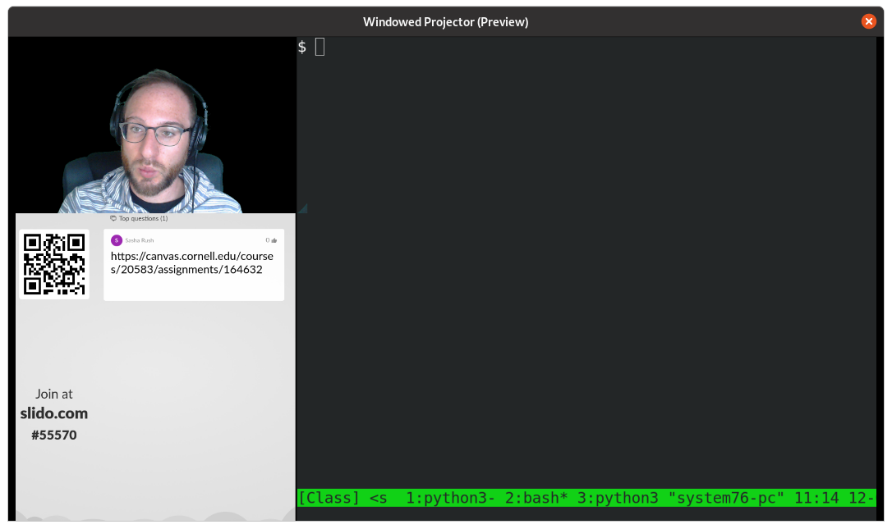
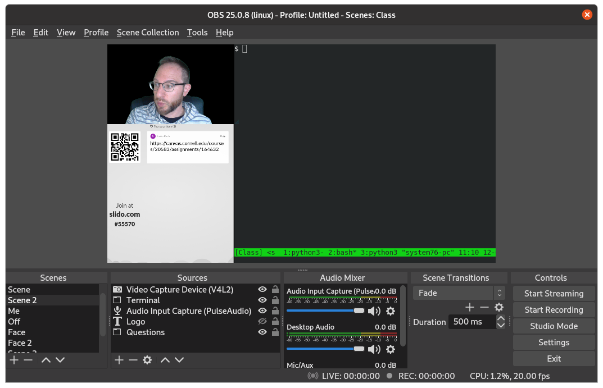

# Virtual Teaching Setup

This page documents my setup for virtual teaching in Fall 2020. I teach Machine Learning Engineering at Cornell Tech with about 110 registered students. The course is taught in 3 1-hour sessions at 11 am Tues/Thurs and 9pm on Thurs (for international student equity). 

## Constraints

* I wanted to teach in an interactive mode. Many of my colleagues swear by the flipped classroom setting.

* My 1-bedroom apartment is ~700 sq feet. My partner uses the main room, so I am in the bedroom. I roughly have a 4 foot x 5 foot space. 

* Needed to use my linux desktop (https://system76.com/) for streaming.

## Equipment

I spent roughly $500 on additional equipment for teaching. 

*  <a href="https://www.amazon.com/Blue-Snowball-Condenser-Microphone-Cardioid/dp/B006DIA77E/ref=sr_1_5?crid=275YURS34P97Z&dchild=1&keywords=blue+snowball+mic&qid=1602514615&sprefix=blue+sno%2Caps%2C137&sr=8-5">Snowball Microphone</a>

*  <a href="https://www.amazon.com/Logitech-C920x-Pro-HD-Webcam/dp/B085TFF7M1/ref=asc_df_B085TFF7M1/?tag=hyprod-20&linkCode=df0&hvadid=459641872450&hvpos=&hvnetw=g&hvrand=9866461222765604603&hvpone=&hvptwo=&hvqmt=&hvdev=c&hvdvcmdl=&hvlocint=&hvlocphy=9004331&hvtargid=pla-943627420681&psc=1">Logitech 1080p Webcam </a>

*  <a href="https://www.amazon.com/Neewer-Collapsible-Reversible-Chromakey-Background/dp/B00E89Q5OY/ref=sr_1_4?crid=3M4SA7NOXXFO0&dchild=1&keywords=green+screen&qid=1602514709&s=electronics&sprefix=green%2Celectronics%2C144&sr=1-4">ChromaKey Green Screen</a>

* <a href="https://www.amazon.com/Workbench-Reading-Streaming-Architect-Drafting/dp/B07P1G8CD4/ref=sr_1_20?dchild=1&keywords=usb+ring+light&qid=1602514764&sr=8-20"> Workbench Ring Light</a>

*  <a href="https://www.amazon.com/Dell-Screen-LED-Lit-Monitor-P2419H/dp/B07F8XZN69/ref=sr_1_6?crid=1KXV0WO6KP1FR&dchild=1&keywords=dell+monitor&qid=1602514839&sprefix=dell+%2Caps%2C150&sr=8-6">Second monitor</a>

*  <a href="https://www.amazon.com/Sony-MDR7506-Professional-Diaphragm-Headphone/dp/B000AJIF4E/ref=sr_1_2?crid=398Q1YQ4STQ8Y&dchild=1&keywords=sony+studio+monitor+headphones&qid=1602514906&sprefix=sony+studio+monit%2Caps%2C146&sr=8-2">Sony Studio Headphones</a>

## Streaming

At Cornell Tech we use Zoom for teaching (and everything else). So I needed to stream through that. 

On my side I use <a href="https://obsproject.com/">OBS</a> to stream my class. It seems to be standard, and it is FOSS so that's great. 

The OBS tools are super easy to use. I was able to create some windows that let me show my terminal (Konsole), webcam, and browser windows (Firefox). I have a couple of different Scene templates that I switch through during class. 

### OBS Setup / Issues

* In order to use OBS with zoom, I followed the setup instructions here: https://www.eigenmagic.com/2020/04/22/how-to-use-obs-studio-with-zoom/ 
* An alternative approach that works just as well is to create Preview window in OBS and then to share screen that window during class. 
* The XComposite screen share in OBS is quite buggy in Ubuntu. I had to switch from the default desktop to Gnome and use Firefox to get it to work. 
* The default streaming setup was quite low quality. I had to go to Setting->Output to turn it up to something reasonable. 
* In order to use the green screen, you need to add a Chroma filter on the camera output. This works well if you have enough light. The ring light helps with this for my night classes. 

## Software

* OBS / Zoom for streaming
* Slido - used to answer questions and comments during class
* Canvas Quizzes - used to give in class quizzes (mostly for attendance sake)
* IPython / Notebooks - useful for in-class code demonstrations and question answering
* Witeboard (https://witeboard.com/) - used if I need to draw diagrams on my ipad for technical explanations

## Slides

I decided to try out less technical slides this semester to avoid any resolution issues with streaming. My slides are written using <a href="https://revealjs.com/">revealjs</a> through the <a href="https://pypi.org/project/sphinx-revealjs/">sphinx</a> plugin. There is an example in the slides directory. 
